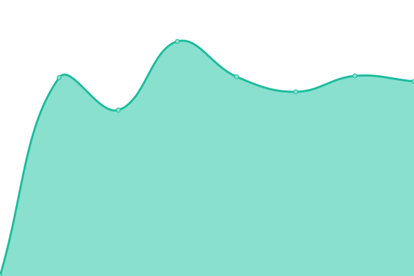
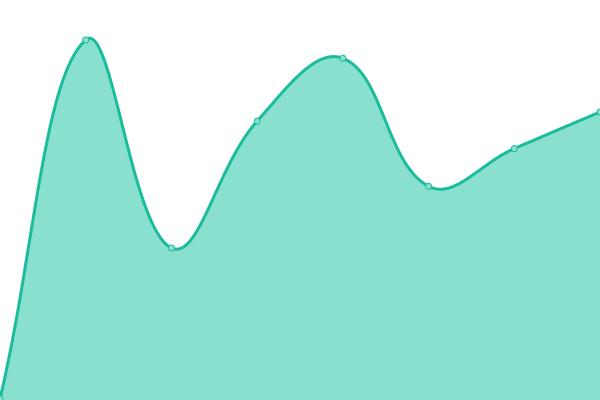
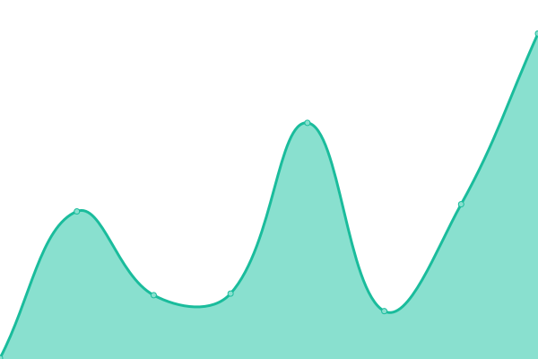

# [📈 Live Status](https://status.nomodo.io): <!--live status--> **🟩 All systems operational**

This repository contains the open-source uptime monitor and status page for [nomodo.io](https://nomodo.io), powered by [Upptime](https://github.com/upptime/upptime).

With [Upptime](https://upptime.js.org), you can get your own unlimited and free uptime monitor and status page, powered entirely by a GitHub repository. We use [Issues](https://github.com/nomodoio/bug-free-train/issues) as incident reports, [Actions](https://github.com/nomodoio/bug-free-train/actions) as uptime monitors, and [Pages](https://status.nomodo.io) for the status page.

<!--start: status pages-->
<!-- This summary is generated by Upptime (https://github.com/upptime/upptime) -->
<!-- Do not edit this manually, your changes will be overwritten -->
<!-- prettier-ignore -->
| URL | Status | History | Response Time | Uptime |
| --- | ------ | ------- | ------------- | ------ |
|  [Admin](https://admin.nomodo.io) | 🟩 Up | [admin.yml](https://github.com/nomodoio/bug-free-train/commits/HEAD/history/admin.yml) | 

 2475ms
     
 | 

<a href="https://status.nomodo.io/history/admin">29.48%</a>
    

|  [Web](https://nomodo.io) | 🟩 Up | [web.yml](https://github.com/nomodoio/bug-free-train/commits/HEAD/history/web.yml) | 

 450ms
     
 | 

<a href="https://status.nomodo.io/history/web">29.48%</a>
    

|  [Admin BE](https://adminbe.nomodo.io/health) | 🟩 Up | [admin-be.yml](https://github.com/nomodoio/bug-free-train/commits/HEAD/history/admin-be.yml) | 

 291ms
     
 | 

<a href="https://status.nomodo.io/history/admin-be">29.48%</a>
    

|  [Web BE](https://webbe.nomodo.io/health) | 🟩 Up | [web-be.yml](https://github.com/nomodoio/bug-free-train/commits/HEAD/history/web-be.yml) | 

 300ms
     
 | 

<a href="https://status.nomodo.io/history/web-be">29.48%</a>
    

<!--end: status pages-->

[**Visit our status website →**](https://status.nomodo.io)

## 📄 License

- Powered by: [Upptime](https://github.com/upptime/upptime)
- Code: [MIT](./LICENSE) © [nomodo.io](https://nomodo.io)
- Data in the `./history` directory: [Open Database License](https://opendatacommons.org/licenses/odbl/1-0/)
